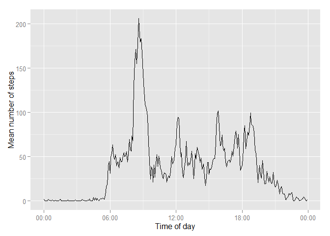
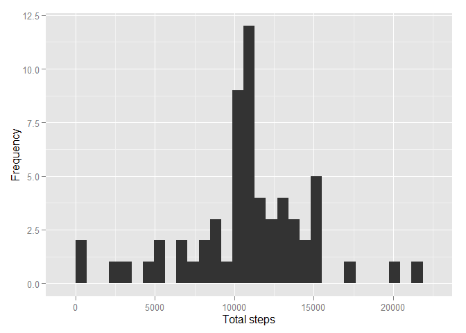

### 1. Loading and preprocessing the data

#### Set the 'Working directory'

```r
path <- getwd()
```

#### Read the 'Activity' data

```r
path <- getwd()
dt_Activity <- read.table(file.path(path, "repdata-data-activity", "activity.csv"),header = TRUE, sep = ",")
```

#### Convert the 'Interval' value into 'min' and create a new column by combining both 'Date' and 'min' values

```r
time <- formatC(dt_Activity$interval/100, 2, format = "f")
dt_Activity$date.time <- as.POSIXct(paste(dt_Activity$date, time), format = "%Y-%m-%d %H.%M", tz = "GMT")
```

### 2. What is mean total number of steps taken per day? 

#### Calculate the total number per day

```r
totalSteps <- tapply(dt_Activity$steps, dt_Activity$date, sum, na.rm = TRUE)
```

#### Calculate the mean and median for total steps / day

```r
mean(totalSteps)
```

```
## [1] 9354.23
```

```r
median(totalSteps)
```

```
## [1] 10395
```

####  Histogram of the total number of steps taken each day

```r
library(ggplot2)
qplot(totalSteps, xlab = "Total steps", ylab = "Frequency")
```

```
## stat_bin: binwidth defaulted to range/30. Use 'binwidth = x' to adjust this.
```

 

### 3. What is the average daily activity pattern?

#### Add a 'Time' column

```r
dt_Activity$time <- format(dt_Activity$date.time, format = "%H:%M:%S")
dt_Activity$time <- as.POSIXct(dt_Activity$time, format = "%H:%M:%S")
```
#### Calculate the mean steps for every five mins interval

```r
meanSteps <- tapply(dt_Activity$steps, dt_Activity$time, mean, na.rm = TRUE)
df_Activity_pattern <- data.frame(Time = as.POSIXct(names(meanSteps)), meanSteps = meanSteps)
```
#### Mean steps vs Time plot

```r
library(scales)
ggplot(df_Activity_pattern , aes(Time, meanSteps)) + geom_line() + xlab("Time of day") + 
    ylab("Mean number of steps") + scale_x_datetime(labels = date_format(format = "%H:%M"))
```

 

### 4. Imputing missing values

#### Calculate the missing value (NA's)

```r
summary(dt_Activity$steps)
```

```
##    Min. 1st Qu.  Median    Mean 3rd Qu.    Max.    NA's 
##    0.00    0.00    0.00   37.38   12.00  806.00    2304
```

#### Create a new dataset from the original dataset , and fill the 'Missing value'

```r
dt_Activity_Impute <- dt_Activity
library(Hmisc)
```

```
## Warning: package 'Hmisc' was built under R version 3.1.3
```

```
## Loading required package: grid
## Loading required package: lattice
## Loading required package: survival
## Loading required package: splines
## Loading required package: Formula
```

```
## Warning: package 'Formula' was built under R version 3.1.3
```

```
## 
## Attaching package: 'Hmisc'
## 
## The following objects are masked from 'package:base':
## 
##     format.pval, round.POSIXt, trunc.POSIXt, units
```

```r
dt_Activity_Impute$steps <- with(dt_Activity_Impute, impute(steps, mean))
summary(dt_Activity_Impute$steps)
```

```
## 
##  2304 values imputed to 37.3826
```

```
##    Min. 1st Qu.  Median    Mean 3rd Qu.    Max. 
##    0.00    0.00    0.00   37.38   37.38  806.00
```
#### Compare the mean and median steps for each day between the original data set and the imputed data set

#### Calculate the total number per day from Imputed data set

```r
totalSteps_Imputed <- tapply(dt_Activity_Impute$steps, dt_Activity_Impute$date, sum)
```

#### Compare the mean and median - Original vs Imputed data set

```r
mean(totalSteps)
```

```
## [1] 9354.23
```

```r
median(totalSteps)
```

```
## [1] 10395
```

```r
mean(totalSteps_Imputed)
```

```
## [1] 10766.19
```

```r
median(totalSteps_Imputed)
```

```
## [1] 10766.19
```

#### Histogram of the total number of steps (Imputed data) taken each day

```r
qplot(totalSteps_Imputed, xlab = "Total steps", ylab = "Frequency")
```

```
## stat_bin: binwidth defaulted to range/30. Use 'binwidth = x' to adjust this.
```

 

### 5. Are there differences in activity patterns between weekdays and weekends?

#### Add a factor column [ a day is 'weekend' or 'weekday']

```r
day_type <- function(date){
  if(weekdays(date) %in% c("Saturday", "Sunday")){
      return("weekend")
  }else{
    return("weekday")
  }
}

dayTypes = sapply(dt_Activity_Impute$date.time, day_type)
dt_Activity_Impute$day.type <- as.factor(dayTypes)
```

#### Create a dataframe that stores mean steps value for ' Day type' values

```r
meanSteps <- tapply(dt_Activity_Impute$steps, interaction(dt_Activity_Impute$time, dt_Activity_Impute$day.type), mean, na.rm = TRUE)
df_dayType_pattern <- data.frame(Time = as.POSIXct(names(meanSteps)), meanSteps = meanSteps, day.type = as.factor(c("weekend", "weekday")))
```
#### Display two patterns for weekdays and weekends

```r
ggplot(df_dayType_pattern , aes(Time, meanSteps)) + geom_line() + xlab("Time of day") + 
    ylab("Mean number of steps") + scale_x_datetime(labels = date_format(format = "%H:%M")) + facet_grid(. ~ day.type)
```

 
